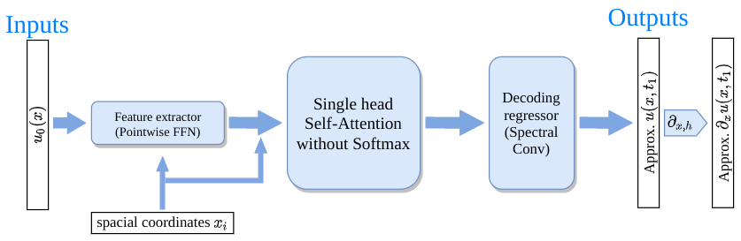
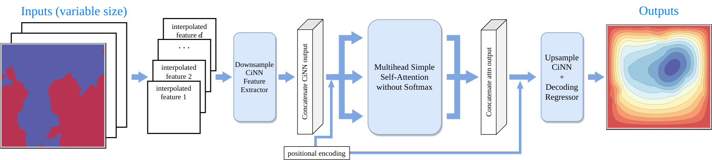
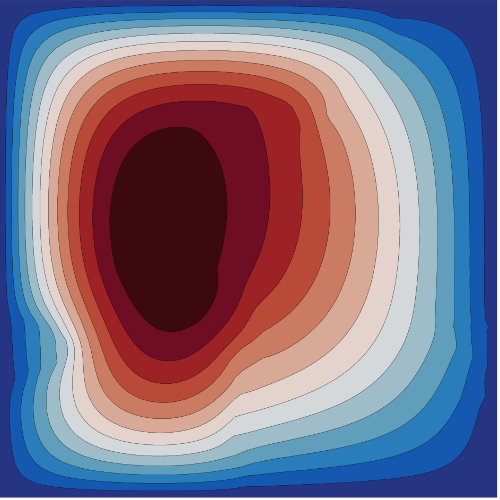
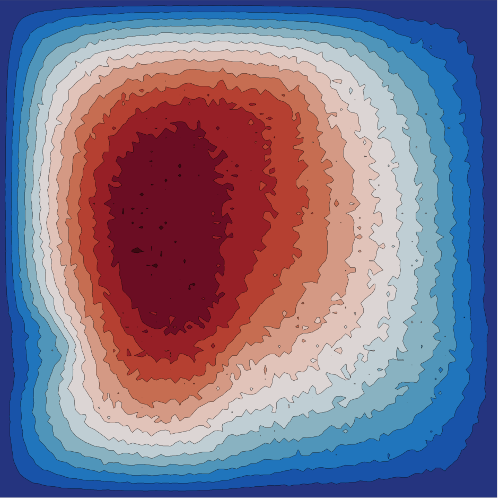
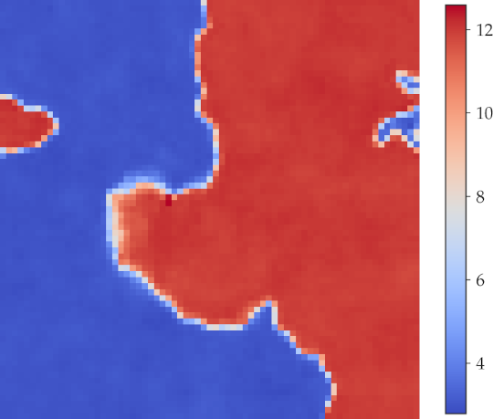

# Examples 

## Training details for each model
By default the evaluation is performed on the last 100 samples in the test dataset like the code in [FNO repo](https://github.com/zongyi-li/fourier_neural_operator). All trainers are using the [`1cycle` scheduler](https://arxiv.org/abs/1708.07120) in [PyTorch](https://pytorch.org/docs/master/generated/torch.optim.lr_scheduler.OneCycleLR.html) for 100 epochs. Every example has a `--seed $SEED` argument and the default seed is 1127802. Again if you have a system wide env variable named `SEED`, the code will use that seed instead. 

### A caveat for Darcy problems
Since [`nn.functional.interpolate`](https://pytorch.org/docs/master/generated/torch.nn.functional.interpolate.html) is used in Darcy examples, a fixed seed may still yield different results each training cycle on GPU according to PyTorch documents, but we have verified that the variance is negligible. Some example set-ups are as follows.


## Possible arguments
- `--no-cuda`: use CPU, not recommended.
- `--layer-norm`: use the conventional layer normalization scheme that kills all scalings.
- `--attention-type`: `'softmax'`,  `'fourier'`,  `'linear'`, or  `'galerkin'`.
- `--batch-size` + a number (2, 4, 8, 16). If using `softmax` type attention on a single GPU with VRAM less than 20G, max `batch_size` for 2D problem has to be 2 when the fine grid is of size bigger than `211x211`.
- `--lr`: max learning rate in `1cycle`, when attention is `'softmax'` please use `5e-4` instead of the default `1e-3`.
- `--xavier-init`: [gain for Xavier initialization](https://pytorch.org/docs/stable/_modules/torch/nn/init.html#xavier_normal_) for `W^{Q,K,V}`.
- `--diagonal-weight`: a small diagonal matrix is added to the initialization of `W^{Q,K,V}`, recommended value is `1e-2`.
- `--encoder-dropout`: dropout for the attention weights.
- `--ffn-dropout`: dropout for the FFN in attention blocks.
- `--decoder-dropout`: dropout in the decoder block.
- `--gamma`: the strength of the $H^1$-seminorm regularizer, `0.1` in Example 1, and `0.5` in Example 2. When the target is not a smooth function, set this to 0.
- `--no-scale-factor`: use explicit size instead of scale factor in `torch.nn.functional.interpolate`.
- `--seed`: RNG, default `1127802`.
- `--show-batch`: show the progress bar following each batch, instead of the default epoch progress bar, not recommended in the interactive mode.


## Remarks on various comparisons
- If we want to compare with the regular layer normalization scheme, just add `--layer-norm` in the end, the new scale-preserving layer normalization will be automatically disabled.
- If we want to compare the softmax normalized counterparts, just change `'galerkin'` to `'linear'`, `'fourier'` to `'softmax'`, and the setting should be carried over. 
- If we want to use the default setting of the original Transformer, please use `--xavier-init 1 --diagonal-weight 0 --ffn-dropout 0.1 --encoder-dropout 0.1` in the arguments.
- By default, the noise for the inverse coefficient identification problem in Example 3 is 0.01. If we want to have a specific noise, please `--noise $NOISE`. Note than the noises are added to both train and test.
- If we want to compare with the FNO baselines, please clone the repo at https://github.com/zongyi-li/fourier_neural_operator to local, and change the scheduler in `fourier_1d.py` and `fourier_2d.py` to match the current scheduler in our repo:
    ```python
    epochs = 100
    scheduler = OneCycleLR(optimizer, max_lr=1e-3, div_factor=1e4, final_div_factor=1e4,
                            steps_per_epoch=len(train_loader), epochs=epochs)
    ```
    Moreover, please move the `scheduler.step()` from the end of each epoch to the end of each batch right after `optimizer.step()`.


## Example 1 viscous Burgers



The baseline benchmark [`ex1_burgers.py`](../examples/): evaluation relative error is about `1e-3` with a simple pointwise forward expansion feature extractor with only 100 epochs of training. Using the common 500 epochs of training the evaluation error is about `7e-4`. The input is the initial condition of a viscous Burgers' equation on a discrete grid, the output is an approximation to the solution marched to time $1$. The initial data are generating using a GRF and the data in the validation set are not in the train set.

Default benchmark on a 2048 grid using a Fourier Transformer, with 4 Fourier-type attention encoder layers as the encoder and 2 spectral convolution layers from [Li et al 2020](https://github.com/zongyi-li/fourier_neural_operator) as the decoder (to reduce the overfit we decrease the `dmodel` of the spectral conv from the original 64 to 48):
```bash
python ex1_burgers.py
```

On the finest grid, `n=8192` (no subsampling), it is recommended to use the Galerkin-type attention. Using the diagonal dominant initialization is recommended for even the classic softmax normalized Transformers, as the regular Xavier initialization with gain `1` will result diverging training depending on seed.

Fourier Transformer model:
```bash
python ex1_burgers.py --subsample 1 --attention-type 'fourier' --xavier-init 0.001 --diagonal-weight 0.01  --ffn-dropout 0.05 --batch-size 4
```

Galerkin Transformer model:
```bash
python ex1_burgers.py --subsample 1 --attention-type 'galerkin' --xavier-init 0.01 --diagonal-weight 0.01 --batch-size 4
```

Note that we add a diagonal matrix to the Xavier initializations of the `W^Q, W^K, W^V` matrices (about 30%-1000% better than those without depending on other settings). If we want to try the standard softmax normalization `Softmax(QK^T/sqrt{d})V`, conventional layer normalization application scheme, default Xavier initialization (the result is not very good...).
```bash
python ex1_burgers.py --attention-type 'softmax' --layer-norm --xavier-init 1.0 --diagonal-weight 0.0 --batch_size 4
```

Subsample 4, i.e., `n=2048`.

```bash
python ex1_burgers.py --subsample 4 --attention-type 'fourier' --xavier-init 0.001 --diagonal-weight 0.01  --ffn-dropout 0.05 --batch-size 4
```

```bash
python ex1_burgers.py --subsample 4 --attention-type 'galerkin' --xavier-init 0.01 --diagonal-weight 0.01 --batch-size 4
```


## Example 2 an interface Darcy flow:



The baseline benchmark [`ex2_darcy.py`](./): evaluation relative error is about `8e-3` to `1e-2` with a 3-level interpolation-based CNN (CiNN) feature extractor. The coarse grid latent representation is sent to attention layers The operator input is discontinuous coefficient with a random interface sampled at a discrete grid, the output is a finite difference approximation to the solution restricted to the sampled grid from a fine `421x421` grid. The coefficient in the validation set are not in the train set.

Default benchmark on a 141x141 grid using the Galerkin Transformer, 6 Galerkin-type attention layers with `d_model=128` and `nhead=4` as the encoder, and 2 spectral conv layers from [Li et al 2020](https://github.com/zongyi-li/fourier_neural_operator) as the decoder. There is a small dropout `5e-2` in the attention layer as well as in the feature extraction layer:
```bash
python ex2_darcy.py
```
For a smaller memory GPU or CPU, please use the 85x85 grid fine, 29x29 coarse grid setting:
```bash
python ex2_darcy.py --subsample-attn 15 --subsample-nodes 5 --attention-type 'galerkin' --xavier-init 0.01 --diagonal-weight 0.01
```

Default: `141x141` fine grid, `43x43` coarse grid: 

```bash
python ex2_darcy.py --subsample-attn 10 --subsample-nodes 3 --attention-type 'galerkin' --xavier-init 0.01 --diagonal-weight 0.01
```

```bash
python ex2_darcy.py --subsample-attn 10 --subsample-nodes 3 --attention-type 'fourier' --xavier-init 0.001 --diagonal-weight 0.01 --ffn-dropout 0.1 --encoder-dropout 0.05
```

`211x211` fine grid, `61x61` coarse grid:
```bash
python ex2_darcy.py --subsample-attn 7 --subsample-nodes 2 --attention-type 'galerkin' --xavier-init 0.01 --diagonal-weight 0.01 --ffn-dropout 0.05 --encoder-dropout 0.1
```

Using Fourier attention is not recommended (slow due to the `n^2`-complexity of local attention):
```bash
python ex2_darcy.py --subsample-attn 7 --subsample-nodes 2 --attention-type 'fourier' --xavier-init 0.001 --diagonal-weight 0.01 --ffn-dropout 0.1 --encoder-dropout 0.05
```

## Example 3 inverse interface coefficient identification for Darcy flow:

Example 3 is an inverse interface coefficient identification for Darcy flow based on the same dataset used in Example 2. However, in this example, the input and the target are reversed, i.e., the target is the interface coefficient with a random geometry, and the input is the finite difference approximation to the PDE problem, together with an optional noise added to the input to simulate measurement errors. Due to a limit of interpolation operator having no approximation property to nonsmooth functions, the coefficient cannot be resolved at the resolution, the target is sampled at a lower resolution than the input. 


**Evaluation input data with no noise**



**Evaluation input data with 10% noise fed to the model**



**True target (diffusion coefficient with a sharp interface)**


**Reconstructed target**



The baseline benchmark [`ex3_darcy_inv.py`](./):  Evaluation relative error is about `1.5e-2` to `2e-2` without noise, `2.5e-2` with 1% noise, and `7e-2` to `8e-2` with 10% noise in both train and test. If the training data is clean, then adding noise would not generalize well in the test. It is recommended to training with a reasonable amount of noise. 

Default benchmark is on a 141x141 fine grid input and a 36x36 coarse grid coefficient output. The model is the Galerkin Transformer with 6 stacked Galerkin-type attention layers (`d_model=192`, `nhead=4`) with a simple pointwise feed-forward neural network to map the attention output back the desired dimension. There is a small dropout in every key components of the network (`5e-2`). The noise is added to the normalized input, so 0.01 noise means 1%, and 0.1 means 10%. By default there is 1% noise added.
```bash
python ex3_darcy_inv.py --noise 0.01
```
For more choices of arguments, please refer to [Example 3 in models](#Example-3-inverse-Darcy).

To add noise in both train and test data, just use `--noise $NOISE`. `0.1` means `10%` noise, etc; default is adding the 1% noise in both train and test.

Default `141x141` fine grid, `36x36` coarse grid:
```bash
python ex3_darcy_inv.py --attention-type 'galerkin' --xavier-init 0.01 --diagonal-weight 0.01
```

```bash
python ex3_darcy_inv.py --attention-type 'fourier' --xavier-init 0.01 --diagonal-weight 0.01 --lr 0.001
```

On a `211x211` fine grid, `71x71` coarse grid: 
```bash
python ex3_darcy_inv.py --subsample-attn 6 --subsample-nodes 2 --attention-type 'galerkin' --xavier-init 0.01 --diagonal-weight 0.01
```
Using Fourier-type attention is not recommended as it is slow. 
```bash
python ex3_darcy_inv.py --subsample-attn 6 --subsample-nodes 2 --attention-type 'fourier' --xavier-init 0.01 --diagonal-weight 0.01 --ffn-dropout 0.1 --lr 0.0005
```


## Memory and speed profiling using `autograd.profiler`

Using CUDA, Fourier Transformer features an over 40% reduction in `self_cuda_memory_usage` versus the standard softmax normalized transformers, and Galerkin Transformer's the backpropagation speed has a 20% to 100% increase over the standard linearized transformers. If no GPU is available please enable the `--no-cuda` switch.


### Example 1:

Example 1 memory profile of a model with 96 hidden dimension with an input sequence length 8192. Compare the memory usage of the Fourier transformer with the one with softmax
```bash
python ex1_memory_profile.py --batch-size 4 --seq-len 8192 --dmodel 96 --attention-type 'softmax' 'fourier'
```
Compare the backpropagation time usage of the Galerkin transformer versus the same net, but with Galerkin-type simple attention replaced by the standard linearized attention. 
```bash
python ex1_memory_profile.py --batch-size 4 --seq-len 8192 --dmodel 96 --num-iter 100 --attention-type 'linear' 'galerkin'
```

More tests:
```bash
python ex1_memory_profile.py --batch-size 4 --seq-len 8192 --dmodel 96 --num-iter 1 --attention-type 'softmax' 'fourier' 'linear' 'galerkin'
```
Only checking speed not memory
```
python ex1_memory_profile.py --no-memory --batch-size 4 --seq-len 8192 --dmodel 96 --num-iter 1000 --attention-type 'galerkin'
```

### Example 2:
a 2D model with 128 hidden dimension, using the default `141x141` fine grid, `43x43` coarse grid set up.
```bash
python ex2_memory_profile.py --batch-size 4 --dmodel 128 --attention-type 'softmax' 'fourier' 'linear' 'galerkin'
```
To replicate the results in paper:
```bash
python ex2_memory_profile.py --batch-size 4 --dmodel 128 --attention-type 'softmax' 'fourier' 'linear' 'galerkin' --subsample-nodes 2 --subsample-attn 7 --num-iter 1
```

For real memory usage, use `{$ATTN_TYPE}`, it can be `'softmax'`, `'fourier'`, `'linear'`, or `'galerkin'`:
```bash
python ex2_memory_profile.py --batch-size 4 --dmodel 128 --attention-type $ATTN_TYPE --subsample-nodes 2 --subsample-attn 7 --num-iter 1000
```
then open up bash and use `nvidia-smi` to check the active Python process's memory.


### Only encoder profiling

The bottleneck of Example 2 and 3 is actually the feature extractor, to profile encoder wrapper performance only: profile a wrapper with 10 layers of encoder in a model for operators defined for functions whose domain is isomorphic to a 2D Euclidean space. Example:
```bash
python encoder_memory_profile.py --batch-size 4 --dmodel 128 --num-layers 6 -ndim 2
```

```bash
python encoder_memory_profile.py --seq-len 8192 --batch-size 4 --dmodel 128 --head 1 --num-layers 4 --ndim 2 --num-iter 1000 --attention-type 'galerkin'
```

```bash
python encoder_memory_profile.py --seq-len 8192 --batch-size 4 --dmodel 128 --head 1 --num-layers 4 --ndim 2 --num-iter 1000 --attention-type 'fourier'
```


```bash
python encoder_memory_profile.py --seq-len 8192 --batch-size 4 --dmodel 128 --head 1 --num-layers 4 --ndim 2 --num-iter 1000 --attention-type 'softmax'
```


```bash
python encoder_memory_profile.py --seq-len 8192 --batch-size 4 --dmodel 128 --head 1 --num-layers 4 --ndim 2 --num-iter 1000 --attention-type 'linear'
```

```bash
python encoder_memory_profile.py --seq-len 8192 --batch-size 4 --dmodel 128 --head 1 --num-layers 4 --ndim 2 --num-iter 1 --attention-type 'softmax' 'fourier' 'linear' 'galerkin'
```

Galerkin-type attention has a huge edge over the linear attention for long sequences.